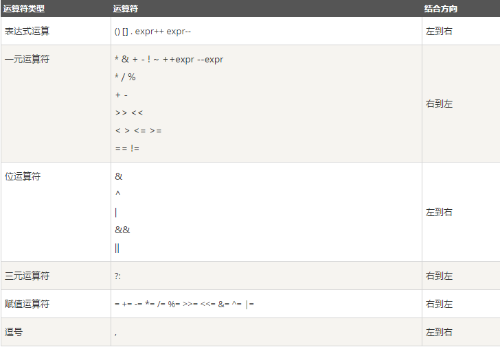

#基本语法

Scala 基本语法需要注意以下几点：

区分大小写 -  Scala是大小写敏感的，这意味着标识Hello 和 hello在Scala中会有不同的含义。

类名 - 对于所有的类名的第一个字母要大写。

如果需要使用几个单词来构成一个类的名称，每个单词的第一个字母要大写。

示例：class MyFirstScalaClass

方法名称 - 所有的方法名称的第一个字母用小写。

如果若干单词被用于构成方法的名称，则每个单词的第一个字母应大写。

示例：def myMethodName()

程序文件名 - 程序文件的名称应该与对象名称完全匹配。

保存文件时，应该保存它使用的对象名称（记住Scala是区分大小写），并追加".scala"为文件扩展名。 （如果文件名和对象名称不匹配，程序将无法编译）。

示例: 假设"HelloWorld"是对象的名称。那么该文件应保存为'HelloWorld.scala"
def main(args: Array[String]) - Scala程序从main()方法开始处理，这是每一个Scala程序的强制程序入口部分。

#Scala 包

定义包

Scala 使用 package 关键字定义包，在Scala将代码定义到某个包中有两种方式：
第一种方法和 Java 一样，在文件的头定义包名，这种方法就后续所有代码都放在该报中。 比如：

    package com.runoob
    class HelloWorld

第二种方法有些类似 C#，如：

    package com.runoob {
      class HelloWorld 
    }

#引用

Scala 使用 import 关键字引用包。

import java.awt.Color  // 引入Color
 
import java.awt._  // 引入包内所有成员
 
    def handler(evt: event.ActionEvent) { //      
    java.awt.event.ActionEvent
      ...  // 因为引入了java.awt，所以可以省去前面的部分
    }

import语句可以出现在任何地方，而不是只能在文件顶部。import的效果从开始延伸到语句块的结束。这可以大幅减少名称冲突的可能性。
如果想要引入包中的几个成员，可以使用selector（选取器）：

    import java.awt.{Color, Font}
 
    // 重命名成员
    import java.util.{HashMap => JavaHashMap}
 
    // 隐藏成员
    import java.util.{HashMap => _, _} // 引入了util包的所有成员，但是HashMap被隐藏了

    注意：默认情况下，Scala 总会引入 java.lang._ 、 scala._ 和 Predef._，这里也能解释，为什么以scala开头的包，在使用时都是省去scala.的。

#Scala 数据类型

Scala 与 Java有着相同的数据类型，下表列出了 Scala 支持的数据类型：

    数据类型	描述
    Byte	8位有符号补码整数。数值区间为 -128 到 127
    Short	16位有符号补码整数。数值区间为 -32768 到 32767
    Int	32位有符号补码整数。数值区间为 -2147483648 到 2147483647
    Long	64位有符号补码整数。数值区间为 -9223372036854775808 到 9223372036854775807
    Float	32位IEEE754单精度浮点数
    Double	64位IEEE754单精度浮点数
    Char	16位无符号Unicode字符, 区间值为 U+0000 到 U+FFFF
    String	字符序列
    Boolean	true或false
    Unit	表示无值，和其他语言中void等同。用作不返回任何结果的方法的结果类型。Unit只有一个实例值，写成()。
    Null	null 或空引用
    Nothing	Nothing类型在Scala的类层级的最低端；它是任何其他类型的子类型。
    Any	Any是所有其他类的超类
    AnyRef	AnyRef类是Scala里所有引用类(reference class)的基类
    
    上表中列出的数据类型都是对象，也就是说scala没有java中的原生类型。在scala是可以对数字等基础类型调用方法的。

#Scala 变量

变量是一种使用方便的占位符，用于引用计算机内存地址，变量创建后会占用一定的内存空间。

基于变量的数据类型，操作系统会进行内存分配并且决定什么将被储存在保留内存中。因此，通过给变量分配不同的数据类型，你可以在这些变量中存储整数，小数或者字母。

在 Scala 中，使用关键词 "var" 声明变量，使用关键词 "val" 声明常量。

    var myVar : String = "Foo"
    val myVal : String = "Foo"
    val xmax, ymax = 100  // xmax, ymax都声明为100
    val (myVar1: Int, myVar2: String) = Pair(40, "Foo")
    val (myVar1, myVar2) = Pair(40, "Foo")

#Scala 访问修饰符

Scala 访问修饰符基本和Java的一样，分别有：private，protected，public。

如果没有指定访问修饰符符，默认情况下，Scala对象的访问级别都是 public。

Scala 中的 private 限定符，比 Java 更严格，在嵌套类情况下，外层类甚至不能访问被嵌套类的私有成员。

#Scala 运算符

* 算术运算符
* 关系运算符
* 逻辑运算符
* 位运算符
* 赋值运算符

##算术运算符

下表列出了 Scala 支持的算术运算符。

假定变量 A 为 10，B 为 20：

    运算符	描述	实例
    +	加号	A + B 运算结果为 30
    -	减号	A - B 运算结果为 -10
    *	乘号	A * B 运算结果为 200
    /	除号	B / A 运算结果为 2
    %	取余	B % A 运算结果为 0

##关系运算符

下表列出了 Scala 支持的关系运算符。

假定变量 A 为 10，B 为 20：

    运算符	描述	实例
    ==	等于	(A == B) 运算结果为 false
    !=	不等于	(A != B) 运算结果为 true
    >	大于	(A > B) 运算结果为 false
    <	小于	(A < B) 运算结果为 true
    >=	大于等于	(A >= B) 运算结果为 false
    <=	小于等于	(A <= B) 运算结果为 true

##逻辑运算符

下表列出了 Scala 支持的逻辑运算符。

假定变量 A 为 1，B 为 0：

    运算符	描述	实例
    &&	逻辑与	(A && B) 运算结果为 false
    ||	逻辑或	(A || B) 运算结果为 true
    !	逻辑非	!(A && B) 运算结果为 true

##位运算符

位运算符用来对二进制位进行操作，~,&,|,^分别为取反，按位与与，按位与或，按位与异或运算，如下表实例：

    p	q	p & q	p | q	p ^ q
    0	0	0	    0	    0
    0	1	0	    1	    1
    1	1	1   	1	    0
    1	0	0   	1	    1

Scala 中的按位运算法则如下：

    运算符	描述	实例
    &	按位与运算符	(a & b) 输出结果 12 ，二进制解释： 0000 1100
    |	按位或运算符	(a | b) 输出结果 61 ，二进制解释： 0011 1101
    ^	按位异或运算符	(a ^ b) 输出结果 49 ，二进制解释： 0011 0001
    ~	按位取反运算符	(~a ) 输出结果 -61 ，二进制解释： 1100 0011， 在一个有符号二进制数的补码形式。
    <<	左移动运算符	a << 2 输出结果 240 ，二进制解释： 1111 0000
    >>	右移动运算符	a >> 2 输出结果 15 ，二进制解释： 0000 1111
    >>>	无符号右移	A >>>2 输出结果 15, 二进制解释: 0000 1111

赋值运算符

以下列出了 Scala 语言支持的赋值运算符:

    运算符	描述	实例
    =	简单的赋值运算，指定右边操作数赋值给左边的操作数。	C = A + B 将 A + B 的运算结果赋值给 C
    +=	相加后再赋值，将左右两边的操作数相加后再赋值给左边的操作数。	C += A 相当于 C = C + A
    -=	相减后再赋值，将左右两边的操作数相减后再赋值给左边的操作数。	C -= A 相当于 C = C - A
    *=	相乘后再赋值，将左右两边的操作数相乘后再赋值给左边的操作数。	C *= A 相当于 C = C * A
    /=	相除后再赋值，将左右两边的操作数相除后再赋值给左边的操作数。	C /= A 相当于 C = C / A
    %=	求余后再赋值，将左右两边的操作数求余后再赋值给左边的操作数。	C %= A is equivalent to C = C % A
    <<=	按位左移后再赋值	C <<= 2 相当于 C = C << 2
    >>=	按位右移后再赋值	C >>= 2 相当于 C = C >> 2
    &=	按位与运算后赋值	C &= 2 相当于 C = C & 2
    ^=	按位异或运算符后再赋值	C ^= 2 相当于 C = C ^ 2
    |=	按位或运算后再赋值	C |= 2 相当于 C = C | 2

#运算符优先级

基本的优先级需要记住：

* 指针最优，单目运算优于双目运算。如正负号。
* 先乘除（模），后加减。
* 先算术运算，后移位运算，最后位运算。请特别注意：1 << 3 + 2 & 7 等价于 (1 << (3 + 2))&7
* 逻辑运算最后计算

#Scala 循环

##循环类型

Scala 语言提供了以下几种循环类型。点击链接查看每个类型的细节。

    循环类型	        描述
    while 循环     	运行一系列语句，如果条件为true，会重复运行，直到条件变为false。
    do...while 循环	类似 while 语句区别在于判断循环条件之前，先执行一次循环的代码块。
    for 循环	        用来重复执行一系列语句直到达成特定条件达成，一般通过在每次循环完成后增加计数器的值来实现。

#Scala 函数

函数是一组一起执行一个任务的语句。 您可以把代码划分到不同的函数中。如何划分代码到不同的函数中是由您来决定的，但在逻辑上，划分通常是根据每个函数执行一个特定的任务来进行的。

Scala 有函数和方法，二者在语义上的区别很小。Scala 方法是类的一部分，而函数是一个对象可以赋值给一个变量。换句话来说在类中定义的函数即是方法。

我们可以在任何地方定义函数，甚至可以在函数内定义函数（内嵌函数）。更重要的一点是 Scala 函数名可以由以下特殊字符：+, ++, ~, &,-, -- , \, /, : 等。

    def functionName ([参数列表]) : [return type]

    def functionName ([参数列表]) : [return type] = {
       function body
       return [expr]
    }

Scala也是一种函数式语言，所以函数是 Scala 语言的核心。以下一些函数概念有助于我们更好的理解 Scala 编程：

    函数传名调用(Call-by-Name)	  指定函数参数名
    函数 - 可变参数	              递归函数
    默认参数值	                  高阶函数
    内嵌函数	                      匿名函数
    偏应用函数           	          函数柯里化(Function Currying)

Scala的解释器在解析函数参数(function arguments)时有两种方式：

    传值调用（call-by-value）：先计算参数表达式的值，再应用到函数内部；
    传名调用（call-by-name）：将未计算的参数表达式直接应用到函数内部

一般情况下函数调用参数，就按照函数定义时的参数顺序一个个传递。但是我们也可以通过指定函数参数名，并且不需要按照顺序向函数传递参数，实例如下：

    object Test {
       def main(args: Array[String]) {
            printInt(b=5, a=7);
       }
       def printInt( a:Int, b:Int ) = {
          println("Value of a : " + a );
          println("Value of b : " + b );
       }
    }

Scala 允许你指明函数的最后一个参数可以是重复的，即我们不需要指定函数参数的个数，可以向函数传入可变长度参数列表。

Scala 通过在参数的类型之后放一个星号来设置可变参数(可重复的参数)。例如：

    object Test {
       def main(args: Array[String]) {
            printStrings("Runoob", "Scala", "Python");
       }
       def printStrings( args:String* ) = {
          var i : Int = 0;
          for( arg <- args ){
             println("Arg value[" + i + "] = " + arg );
             i = i + 1;
          }
       }
    }

递归函数在函数式编程的语言中起着重要的作用。

Scala 同样支持递归函数。

递归函数意味着函数可以调用它本身。

以上实例使用递归函数来计算阶乘：

    object Test {
       def main(args: Array[String]) {
          for (i <- 1 to 10)
             println(i + " 的阶乘为: = " + factorial(i) )
       }
       
       def factorial(n: BigInt): BigInt = {  
          if (n <= 1)
             1  
          else    
          n * factorial(n - 1)
       }
    }

Scala 可以为函数参数指定默认参数值，使用了默认参数，你在调用函数的过程中可以不需要传递参数，这时函数就会调用它的默认参数值，如果传递了参数，则传递值会取代默认值。实例如下：

    object Test {
        def main(args: Array[String]) {
            println( "返回值 : " + addInt() );
    }
    def addInt( a:Int=5, b:Int=7 ) : Int = {
          var sum:Int = 0
          sum = a + b
    
          return sum
        }
    }

高阶函数（Higher-Order Function）就是操作其他函数的函数。

Scala 中允许使用高阶函数, 高阶函数可以使用其他函数作为参数，或者使用函数作为输出结果。

以下实例中，apply() 函数使用了另外一个函数 f 和 值 v 作为参数，而函数 f 又调用了参数 v：

    object Test {
       def main(args: Array[String]) {
    
          println( apply( layout, 10) )
    
       }
       // 函数 f 和 值 v 作为参数，而函数 f 又调用了参数 v
       def apply(f: Int => String, v: Int) = f(v)
    
       def layout[A](x: A) = "[" + x.toString() + "]"
       
    }

可以在 Scala 函数内定义函数，定义在函数内的函数称之为局部函数。

以下实例我们实现阶乘运算，并使用内嵌函数：

    object Test {
       def main(args: Array[String]) {
          println( factorial(0) )
          println( factorial(1) )
          println( factorial(2) )
          println( factorial(3) )
       }
    
       def factorial(i: Int): Int = {
          def fact(i: Int, accumulator: Int): Int = {
             if (i <= 1)
                accumulator
             else
                fact(i - 1, i * accumulator)
          }
          fact(i, 1)
       }
    }

Scala 中定义匿名函数的语法很简单，箭头左边是参数列表，右边是函数体。

使用匿名函数后，我们的代码变得更简洁了。

下面的表达式就定义了一个接受一个Int类型输入参数的匿名函数:

    var inc = (x:Int) => x+1

上述定义的匿名函数，其实是下面这种写法的简写：

    def add2 = new Function1[Int,Int]{  
    	def apply(x:Int):Int = x+1;  
    } 

以上实例的 inc 现在可作为一个函数，使用方式如下：

    var x = inc(7)-1

同样我们可以在匿名函数中定义多个参数：

    var mul = (x: Int, y: Int) => x*y

Scala 偏应用函数是一种表达式，你不需要提供函数需要的所有参数，只需要提供部分，或不提供所需参数。

如下实例，我们打印日志信息：

    import java.util.Date

    object Test {
      def main(args: Array[String]) {
          val date = new Date
          val logWithDateBound = log(date, _ : String)

          logWithDateBound("message1" )
          Thread.sleep(1000)
          logWithDateBound("message2" )
          Thread.sleep(1000)
          logWithDateBound("message3" )
       }

       def log(date: Date, message: String)  = {
           println(date + "----" + message)
       }
    }

柯里化(Currying)指的是将原来接受两个参数的函数变成新的接受一个参数的函数的过程。新的函数返回一个以原有第二个参数为参数的函数。

首先我们定义一个函数:

    def add(x:Int,y:Int)=x+y

那么我们应用的时候，应该是这样用：add(1,2)

现在我们把这个函数变一下形：

    def add(x:Int)(y:Int) = x + y

那么我们应用的时候，应该是这样用：add(1)(2),最后结果都一样是3，这种方式（过程）就叫柯里化。

    object Test {
       def main(args: Array[String]) {
          val str1:String = "Hello, "
          val str2:String = "Scala!"
          println( "str1 + str2 = " +  strcat(str1)(str2) )
       }
    
       def strcat(s1: String)(s2: String) = {
          s1 + s2
       }
    }

#Scala 闭包

闭包是一个函数，返回值依赖于声明在函数外部的一个或多个变量。

闭包通常来讲可以简单的认为是可以访问一个函数里面局部变量的另外一个函数。

如下面这段匿名的函数：

    var factor = 3  
    val multiplier = (i:Int) => i * factor  

这里我们引入一个自由变量 factor，这个变量定义在函数外面。

这样定义的函数变量 multiplier 成为一个"闭包"，因为它引用到函数外面定义的变量，定义这个函数的过程是将这个自由变量捕获而构成一个封闭的函数。

完整实例

    object Test {  
       def main(args: Array[String]) {  
          println( "muliplier(1) value = " +  multiplier(1) )  
          println( "muliplier(2) value = " +  multiplier(2) )  
       }  
       var factor = 3  
       val multiplier = (i:Int) => i * factor  
    }

#Scala 数组

Scala 语言中提供的数组是用来存储固定大小的同类型元素，数组对于每一门编辑应语言来说都是重要的数据结构之一。

声明数组变量并不是声明 number0、number1、...、number99 一个个单独的变量，而是声明一个就像 numbers 这样的变量，然后使用 numbers[0]、numbers[1]、...、numbers[99] 来表示一个个单独的变量。数组中某个指定的元素是通过索引来访问的。

数组的第一个元素索引为0，最后一个元素的索引为元素总数减1。

    var z:Array[String] = new Array[String](3)

    或

    var z = new Array[String](3)

    z(0) = "Runoob"; z(1) = "Baidu"; z(4/2) = "Google"

    var z = Array("Runoob", "Baidu", "Google")

    object Test {
       def main(args: Array[String]) {
          var myList = Array(1.9, 2.9, 3.4, 3.5)
      
          // 输出所有数组元素
          for ( x <- myList ) {
            println( x )
        }

          // 计算数组所有元素的总和
          var total = 0.0;
          for ( i <- 0 to (myList.length - 1)) {
             total += myList(i);
          }
          println("总和为 " + total);
    
          // 查找数组中的最大元素
          var max = myList(0);
          for ( i <- 1 to (myList.length - 1) ) {
             if (myList(i) > max) max = myList(i);
          }
          println("最大值为 " + max);
        
       }
    }

##多维数组

多维数组一个数组中的值可以是另一个数组，另一个数组的值也可以是一个数组。矩阵与表格是我们常见的二维数组。

以上是一个定义了二维数组的实例：

    var myMatrix = ofDim[Int](3,3)

    import Array._

    object Test {
       def main(args: Array[String]) {
          var myMatrix = ofDim[Int](3,3)
      
          // 创建矩阵
          for (i <- 0 to 2) {
             for ( j <- 0 to 2) {
                myMatrix(i)(j) = j;
             }
          }
      
          // 打印二维阵列
          for (i <- 0 to 2) {
             for ( j <- 0 to 2) {
               print(" " + myMatrix(i)(j));
             }
             println();
         }
      }
    }

##创建区间数组

以下实例中，我们使用了 range() 方法来生成一个区间范围内的数组。range() 方法最后一个参数为步长，默认为 1：

    import Array._

    object Test {
       def main(args: Array[String]) {
          var myList1 = range(10, 20, 2)
          var myList2 = range(10,20)

          // 输出所有数组元素
          for ( x <- myList1 ) {
             print( " " + x )
          }
          println()
          for ( x <- myList2 ) {
             print( " " + x )
          }
       }
    }

#Scala Collection

Scala提供了一套很好的集合实现，提供了一些集合类型的抽象。

Scala 集合分为可变的和不可变的集合。

可变集合可以在适当的地方被更新或扩展。这意味着你可以修改，添加，移除一个集合的元素。

而不可变集合类，相比之下，永远不会改变。不过，你仍然可以模拟添加，移除或更新操作。但是这些操作将在每一种情况下都返回一个新的集合，同时使原来的集合不发生改变。
接下来我们将为大家介绍几种常用集合类型的应用：

	Scala List(列表)
List的特征是其元素以线性方式存储，集合中可以存放重复对象。

    Scala Set(集合)
Set是最简单的一种集合。集合中的对象不按特定的方式排序，并且没有重复对象。

	Scala Map(映射)
Map 是一种把键对象和值对象映射的集合，它的每一个元素都包含一对键对象和值对象。

    Scala 元组
元组是不同类型的值的集合

    Scala Option
Option[T] 表示有可能包含值的容器，也可能不包含值。

    Scala Iterator（迭代器）
迭代器不是一个容器，更确切的说是逐一访问容器内元素的方法。

#Scala Iterator（迭代器）

Scala Iterator（迭代器）不是一个集合，它是一种用于访问集合的方法。

迭代器 it 的两个基本操作是 next 和 hasNext。

调用 it.next() 会返回迭代器的下一个元素，并且更新迭代器的状态。

调用 it.hasNext() 用于检测集合中是否还有元素。

让迭代器 it 逐个返回所有元素最简单的方法是使用 while 循环：

    object Test {
        def main(args: Array[String]) {
        val it = Iterator("Baidu", "Google", "Runoob", "Taobao")
      
            while (it.hasNext){
                println(it.next())
            }
        }
    }

    你可以使用 it.min 和 it.max 方法从迭代器中查找最大与最小元素。
    你可以使用 it.size 或 it.length 方法来查看迭代器中的元素个数。

#Scala 类和对象

类是对象的抽象，而对象是类的具体实例。类是抽象的，不占用内存，而对象是具体的，占用存储空间。类是用于创建对象的蓝图，它是一个定义包括在特定类型的对象中的方法和变量的软件模板。

我们可以使用 new 关键字来创建类的对象，实例如下：

    class Point(xc: Int, yc: Int) {
        var x: Int = xc
        var y: Int = yc

        def move(dx: Int, dy: Int) {
            x = x + dx
            y = y + dy
            println ("x 的坐标点: " + x);
            println ("y 的坐标点: " + y);
        }
    }

#Scala 继承

Scala继承一个基类跟Java很相似, 但我们需要注意一下几点：

1. 重写一个非抽象方法必须使用override修饰符。
2. 只有主构造函数才可以往基类的构造函数里写参数。
3. 在子类中重写超类的抽象方法时，你不需要使用override关键字。

接下来让我们来看个实例：

    class Point(xc: Int, yc: Int) {
        var x: Int = xc
        var y: Int = yc

        def move(dx: Int, dy: Int) {
            x = x + dx
            y = y + dy
            println ("x 的坐标点: " + x);
            println ("y 的坐标点: " + y);
        }
    }

    class Location(override val xc: Int, override val yc: Int,
        val zc :Int) extends Point(xc, yc){
        var z: Int = zc

        def move(dx: Int, dy: Int, dz: Int) {
            x = x + dx
            y = y + dy
            z = z + dz
            println ("x 的坐标点 : " + x);
            println ("y 的坐标点 : " + y);
            println ("z 的坐标点 : " + z);
        }
    }

#Scala 单例对象

在 Scala 中，是没有 static 这个东西的，但是它也为我们提供了单例模式的实现方法，那就是使用关键字 object。

Scala 中使用单例模式时，除了定义的类之外，还要定义一个同名的 object 对象，它和类的区别是，object对象不能带参数。

当单例对象与某个类共享同一个名称时，他被称作是这个类的伴生对象：companion object。你必须在同一个源文件里定义类和它的伴生对象。类被称为是这个单例对象的伴生类：companion class。类和它的伴生对象可以互相访问其私有成员。

单例对象实例

    import java.io._

    class Point(val xc: Int, val yc: Int) {
        var x: Int = xc
        var y: Int = yc
        def move(dx: Int, dy: Int) {
            x = x + dx
            y = y + dy
        }
    }

    object Test {
        def main(args: Array[String]) {
            val point = new Point(10, 20)
            printPoint

            def printPoint{
            println ("x 的坐标点 : " + point.x);
            println ("y 的坐标点 : " + point.y);
            }
        }
    }

伴生对象实例

    /* 文件名：Marker.scala
     * author:菜鸟教程
     * url:www.runoob.com
     */

    // 私有构造方法
    class Marker private(val color:String) {

        println("创建" + this)
  
        override def toString(): String = "颜色标记："+ color
  
    }

    // 伴生对象，与类共享名字，可以访问类的私有属性和方法
    object Marker{
  
        private val markers: Map[String, Marker] = Map(
        "red" -> new Marker("red"),
        "blue" -> new Marker("blue"),
        "green" -> new Marker("green")
        )
    
        def apply(color:String) = {
            if(markers.contains(color)) markers(color) else null
        }
  
    
        def getMarker(color:String) = { 
            if(markers.contains(color)) markers(color) else null
        }
        def main(args: Array[String]) { 
            println(Marker("red"))  
            // 单例函数调用，省略了.(点)符号  
		  println(Marker getMarker "blue")  
        }
    }

#Scala Trait(特征)

Scala Trait(特征) 相当于 Java 的接口，实际上它比接口还功能强大。

与接口不同的是，它还可以定义属性和方法的实现。

一般情况下Scala的类只能够继承单一父类，但是如果是 Trait(特征) 的话就可以继承多个，从结果来看就是实现了多重继承。

Trait(特征) 定义的方式与类类似，但它使用的关键字是 trait，如下所示：

    trait Equal {
        def isEqual(x: Any): Boolean
        def isNotEqual(x: Any): Boolean = !isEqual(x)
    }

Scala Trait(特征)更像 Java 的抽象类。

    /* 文件名：Test.scala
     * author:菜鸟教程
     * url:www.runoob.com
     */
    trait Equal {
        def isEqual(x: Any): Boolean
        def isNotEqual(x: Any): Boolean = !isEqual(x)
    }

    class Point(xc: Int, yc: Int) extends Equal {
        var x: Int = xc
        var y: Int = yc
        def isEqual(obj: Any) =
            obj.isInstanceOf[Point] &&
            obj.asInstanceOf[Point].x == x
    }

    object Test {
        def main(args: Array[String]) {
            val p1 = new Point(2, 3)
            val p2 = new Point(2, 4)
            val p3 = new Point(3, 3)

            println(p1.isNotEqual(p2))
            println(p1.isNotEqual(p3))
            println(p1.isNotEqual(2))
        }
    }

##特征构造顺序

特征也可以有构造器，由字段的初始化和其他特征体中的语句构成。这些语句在任何混入该特征的对象在构造时都会被执行。

构造器的执行顺序：

1. 调用超类的构造器；
2. 特征构造器在超类构造器之后、类构造器之前执行；
3. 特质由左到右被构造；
4. 每个特征当中，父特质先被构造；
5. 如果多个特征共有一个父特质，父特质不会被重复构造
6. 所有特征被构造完毕，子类被构造。

构造器的顺序是类的线性化的反向。线性化是描述某个类型的所有超类型的一种技术规格。

#Scala 模式匹配

Scala 提供了强大的模式匹配机制，应用也非常广泛。

一个模式匹配包含了一系列备选项，每个都开始于关键字 case。每个备选项都包含了一个模式及一到多个表达式。箭头符号 => 隔开了模式和表达式。

以下是一个简单的整型值模式匹配实例：

    object Test {
        def main(args: Array[String]) {
            println(matchTest(3))
        }
        def matchTest(x: Int): String = x match {
            case 1 => "one"
            case 2 => "two"
            case _ => "many"
        }
    }

match 对应 Java 里的 switch，但是写在选择器表达式之后。即： 选择器 match {备选项}。

match 表达式通过以代码编写的先后次序尝试每个模式来完成计算，只要发现有一个匹配的case，剩下的case不会继续匹配。

接下来我们来看一个不同数据类型的模式匹配：

    object Test {
        def main(args: Array[String]) {
            println(matchTest("two"))
            println(matchTest("test"))
            println(matchTest(1))
            println(matchTest(6))
        }
        def matchTest(x: Any): Any = x match {
            case 1 => "one"
            case "two" => 2
            case y: Int => "scala.Int"
            case _ => "many"
        }
    }

##使用样例类

使用了case关键字的类定义就是就是样例类(case classes)，样例类是种特殊的类，经过优化以用于模式匹配。

以下是样例类的简单实例:

    object Test {
        def main(args: Array[String]) {
   	        val alice = new Person("Alice", 25)
	        val bob = new Person("Bob", 32)
   	        val charlie = new Person("Charlie", 32)
   
            for (person <- List(alice, bob, charlie)) {
    	       person match {
                    case Person("Alice", 25) => println("Hi Alice!")
                    case Person("Bob", 32) => println("Hi Bob!")
                    case Person(name, age) =>
                    println("Age: " + age + " year, name: " + name + "?")
            }
        }
    }
    // 样例类
        case class Person(name: String, age: Int)
    }

#Scala 正则表达式

Scala 通过 scala.util.matching 包种的 Regex 类来支持正则表达式。以下实例演示了使用正则表达式查找单词 Scala :

    import scala.util.matching.Regex

    object Test {
        def main(args: Array[String]) {
            val pattern = "Scala".r
            val str = "Scala is Scalable and cool"
      
            println(pattern findFirstIn str)
        }
    }

    import scala.util.matching.Regex

    object Test {
        def main(args: Array[String]) {
            val pattern = new Regex("(S|s)cala")  // 首字母可以是大写 S 或小写 s
            val str = "Scala is scalable and cool"
      
            println((pattern findAllIn str).mkString(","))   // 使用逗号 , 连接返回结果
        }
    }

    object Test {
        def main(args: Array[String]) {
            val pattern = "(S|s)cala".r
            val str = "Scala is scalable and cool"
      
            println(pattern replaceFirstIn(str, "Java"))
        }
    }

正则表达式
Scala 的正则表达式继承了 Java 的语法规则，Java 则大部分使用了 Perl 语言的规则。
下表我们给出了常用的一些正则表达式规则：
表达式	匹配规则
^	匹配输入字符串开始的位置。
$	匹配输入字符串结尾的位置。
.	匹配除"\r\n"之外的任何单个字符。
[...]	字符集。匹配包含的任一字符。例如，"[abc]"匹配"plain"中的"a"。
[^...]	反向字符集。匹配未包含的任何字符。例如，"[^abc]"匹配"plain"中"p"，"l"，"i"，"n"。
\\A	匹配输入字符串开始的位置（无多行支持）
\\z	字符串结尾(类似$，但不受处理多行选项的影响)
\\Z	字符串结尾或行尾(不受处理多行选项的影响)
re*	重复零次或更多次
re+	重复一次或更多次
re?	重复零次或一次
re{ n}	重复n次
re{ n,}
re{ n, m}	重复n到m次
a|b	匹配 a 或者 b
(re)	匹配 re,并捕获文本到自动命名的组里
(?: re)	匹配 re,不捕获匹配的文本，也不给此分组分配组号
(?> re)	贪婪子表达式
\\w	匹配字母或数字或下划线或汉字
\\W	匹配任意不是字母，数字，下划线，汉字的字符
\\s	匹配任意的空白符,相等于 [\t\n\r\f]
\\S	匹配任意不是空白符的字符
\\d	匹配数字，类似 [0-9]
\\D	匹配任意非数字的字符
\\G	当前搜索的开头
\\n	换行符
\\b	通常是单词分界位置，但如果在字符类里使用代表退格
\\B	匹配不是单词开头或结束的位置
\\t	制表符
\\Q	开始引号：\Q(a+b)*3\E 可匹配文本 "(a+b)*3"。
\\E	结束引号：\Q(a+b)*3\E 可匹配文本 "(a+b)*3"。
正则表达式实例
实例	描述
.	匹配除"\r\n"之外的任何单个字符。
[Rr]uby	匹配 "Ruby" 或 "ruby"
rub[ye]	匹配 "ruby" 或 "rube"
[aeiou]	匹配小写字母 ：aeiou
[0-9]	匹配任何数字，类似 [0123456789]
[a-z]	匹配任何 ASCII 小写字母
[A-Z]	匹配任何 ASCII 大写字母
[a-zA-Z0-9]	匹配数字，大小写字母
[^aeiou]	匹配除了 aeiou 其他字符
[^0-9]	匹配除了数字的其他字符
\\d	匹配数字，类似: [0-9]
\\D	匹配非数字，类似: [^0-9]
\\s	匹配空格，类似: [ \t\r\n\f]
\\S	匹配非空格，类似: [^ \t\r\n\f]
\\w	匹配字母，数字，下划线，类似: [A-Za-z0-9_]
\\W	匹配非字母，数字，下划线，类似: [^A-Za-z0-9_]
ruby?	匹配 "rub" 或 "ruby": y 是可选的
ruby*	匹配 "rub" 加上 0 个或多个的 y。
ruby+	匹配 "rub" 加上 1 个或多个的 y。
\\d{3}	刚好匹配 3 个数字。
\\d{3,}	匹配 3 个或多个数字。
\\d{3,5}	匹配 3 个、4 个或 5 个数字。
\\D\\d+	无分组： + 重复 \d
(\\D\\d)+/	分组： + 重复 \D\d 对
([Rr]uby(, )?)+	匹配 "Ruby"、"Ruby, ruby, ruby"，等等

#Scala 异常处理

Scala 的异常处理和其它语言比如 Java 类似。

Scala 的方法可以通过抛出异常的方法的方式来终止相关代码的运行，不必通过返回值。

##抛出异常

Scala 抛出异常的方法和 Java一样，使用 throw 方法，例如，抛出一个新的参数异常：

    throw new IllegalArgumentException

    import java.io.FileReader
    import java.io.FileNotFoundException
    import java.io.IOException

    object Test {
        def main(args: Array[String]) {
            try {
                val f = new FileReader("input.txt")
            } catch {
                case ex: FileNotFoundException =>{
                    println("Missing file exception")
                }
                case ex: IOException => {
                    println("IO Exception")
                }
            }
        }
    }

##finally 语句

finally 语句用于执行不管是正常处理还是有异常发生时都需要执行的步骤，实例如下：

    import java.io.FileReader
    import java.io.FileNotFoundException
    import java.io.IOException

    object Test {
        def main(args: Array[String]) {
            try {
                val f = new FileReader("input.txt")
            } catch {
                case ex: FileNotFoundException => {
                println("Missing file exception")
                }
                case ex: IOException => {
                    println("IO Exception")
                }
            } finally {
                println("Exiting finally...")
            }
        }
    }

#Scala 提取器(Extractor)

提取器是从传递给它的对象中提取出构造该对象的参数。

Scala 标准库包含了一些预定义的提取器，我们会大致的了解一下它们。

Scala 提取器是一个带有unapply方法的对象。unapply方法算是apply方法的反向操作：unapply接受一个对象，然后从对象中提取值，提取的值通常是用来构造该对象的值。

以下实例演示了邮件地址的提取器对象：

    object Test {
        def main(args: Array[String]) {
      
        println ("Apply 方法 : " + apply("Zara", "gmail.com"));
        println ("Unapply 方法 : " + unapply("Zara@gmail.com"));
        println ("Unapply 方法 : " + unapply("Zara Ali"));

        }
        // 注入方法 (可选)
        def apply(user: String, domain: String) = {
            user +"@"+ domain
        }

        // 提取方法（必选）
        def unapply(str: String): Option[(String, String)] = {
            val parts = str split "@"
            if (parts.length == 2){
                Some(parts(0), parts(1)) 
            }else{
                None
            }
        }
    }

以上对象定义了两个方法： apply 和 unapply 方法。通过 apply 方法我们无需使用 new 操作就可以创建对象。所以你可以通过语句 Test("Zara", "gmail.com") 来构造一个字符串 "Zara@gmail.com"。

unapply方法算是apply方法的反向操作：unapply接受一个对象，然后从对象中提取值，提取的值通常是用来构造该对象的值。实例中我们使用 Unapply 方法从对象中提取用户名和邮件地址的后缀。

实例中 unapply 方法在传入的字符串不是邮箱地址时返回 None。代码演示如下：

    unapply("Zara@gmail.com") 相等于 Some("Zara", "gmail.com")
    unapply("Zara Ali") 相等于 None

##提取器使用模式匹配

在我们实例化一个类的时，可以带上0个或者多个的参数，编译器在实例化的时会调用 apply 方法。我们可以在类和对象中都定义 apply 方法。

就像我们之前提到过的，unapply 用于提取我们指定查找的值，它与 apply 的操作相反。 当我们在提取器对象中使用 match 语句是，unapply 将自动执行，如下所示：

    object Test {
        def main(args: Array[String]) {
      
            val x = Test(5)
            println(x)

            x match
            {
                case Test(num) => println(x + " 是 " + num + " 的两倍！")
                //unapply 被调用
                case _ => println("无法计算")
            }

        }
        def apply(x: Int) = x*2
        def unapply(z: Int): Option[Int] = if (z%2==0) Some(z/2) else None
    }

#Scala 文件 I/O

Scala 进行文件写操作，直接用的都是 java中 的 I/O 类 （java.io.File)：

    import java.io._

    object Test {
        def main(args: Array[String]) {
            val writer = new PrintWriter(new File("test.txt" ))

            writer.write("菜鸟教程")
            writer.close()
        }
    }

    object Test {
        def main(args: Array[String]) {
            print("请输入菜鸟教程官网 : " )
            val line = Console.readLine
      
            println("谢谢，你输入的是: " + line)
        }
    }

    import scala.io.Source

    object Test {
        def main(args: Array[String]) {
            println("文件内容为:" )

            Source.fromFile("test.txt" ).foreach{ 
                print 
            }
        }
    }
